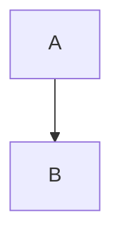

# [功能/任务名称] 完成报告

**文档编号**: COMP-YYYY-MM-DD-XXX
**创建日期**: YYYY-MM-DD
**完成日期**: YYYY-MM-DD
**状态**: 已完成

---

## 概述

<!-- 简要描述完成的工作 -->

---

## 变更摘要

### 新增文件

| 文件路径 | 说明 |
|----------|------|
| | |

### 修改文件

| 文件路径 | 变更说明 |
|----------|----------|
| | |

### 删除文件

| 文件路径 | 删除原因 |
|----------|----------|
| | |

---

## 功能说明

<!-- 详细描述实现的功能 -->

### 功能点 1

**描述**:

**使用方式**:

```
// 示例代码或命令
```

---

## 技术实现

<!-- 描述关键的技术实现细节 -->

### 架构设计

<!-- 如有架构图，使用 Mermaid 语法 -->



### 核心逻辑

<!-- 描述核心算法或逻辑 -->

---

## 测试结果

### 单元测试

| 测试套件 | 通过 | 失败 | 跳过 | 覆盖率 |
|----------|------|------|------|--------|
| | | | | |

### 集成测试

| 测试场景 | 结果 | 备注 |
|----------|------|------|
| | | |

### 性能测试

| 指标 | 基准值 | 实测值 | 是否达标 |
|------|--------|--------|----------|
| | | | |

---

## 已知问题

<!-- 列出已知但未在本次修改中解决的问题 -->

| 问题 | 影响 | 计划处理时间 |
|------|------|--------------|
| | | |

---

## 后续工作

<!-- 列出后续需要跟进的工作 -->

- [ ]
- [ ]

---

## 参考资料

<!-- 列出相关的文档、Issue、PR 等 -->

- 关联进展文档: `/docs/progress/YYYY-MM-DD-xxx.md`
- 关联 Issue: #
- 关联 PR: #
